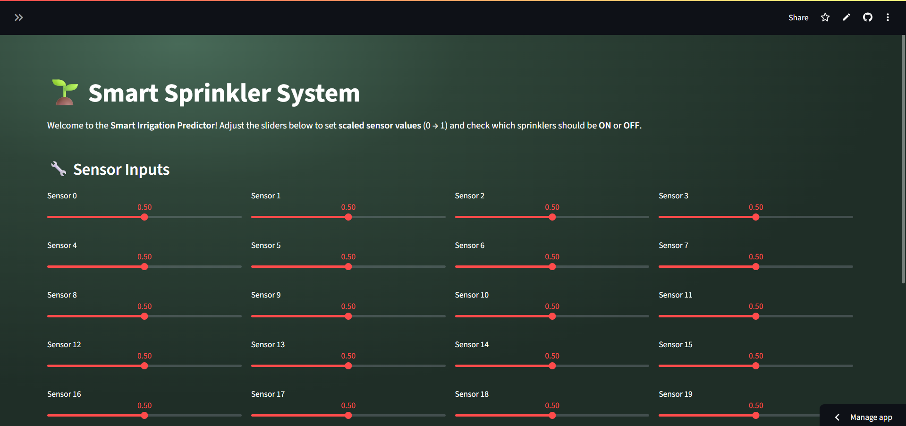

# 🌱 Smart Irrigation System

A machine learning–powered irrigation system that predicts which farm parcels (sprinklers) need to be activated based on real-time sensor data, optimizing water usage and improving farm efficiency.

---

##  Features
- Reads and processes **multi-sensor environmental data** (`sensor_0` to `sensor_19`)
- Performs **multi-label classification** to control multiple irrigation parcels at once
- **Data preprocessing** using MinMax scaling for consistent feature ranges
- **Random Forest + MultiOutputClassifier** for accurate multi-parcel control
- Generates **classification reports** for model performance evaluation
- Visualizes **pump activation patterns** over time
- Saves the trained model (`Farm_Irrigation_System.pkl`) for future predictions

---

## Technologies Used
- **Python** (Pandas, NumPy, Matplotlib, Seaborn)
- **Scikit-learn** (RandomForestClassifier, MultiOutputClassifier, MinMaxScaler)
- **Joblib** for model persistence
- **Streamlit** for UI and deployment
- **Jupyter Notebook** & **Google Colab** for data analysis and training
- **Git** & **GitHub** for version control
- **Visual Studio Code (VS Code)** as the development environment
  
---

##  Preview


---

##  Live Demo
The live version of the Smart Irrigation System here:
🔗 [Smart Irrigation on Streamlit](https://smartirrigation04.streamlit.app/)

---

##  How to Run
### 1. Clone the repository
```bash
git clone https://github.com/Jayita2004/Smart_Irrigation.git
cd Smart_Irrigation
```
### 2. Install all the dependencies 
### 3. Run in Notebook
